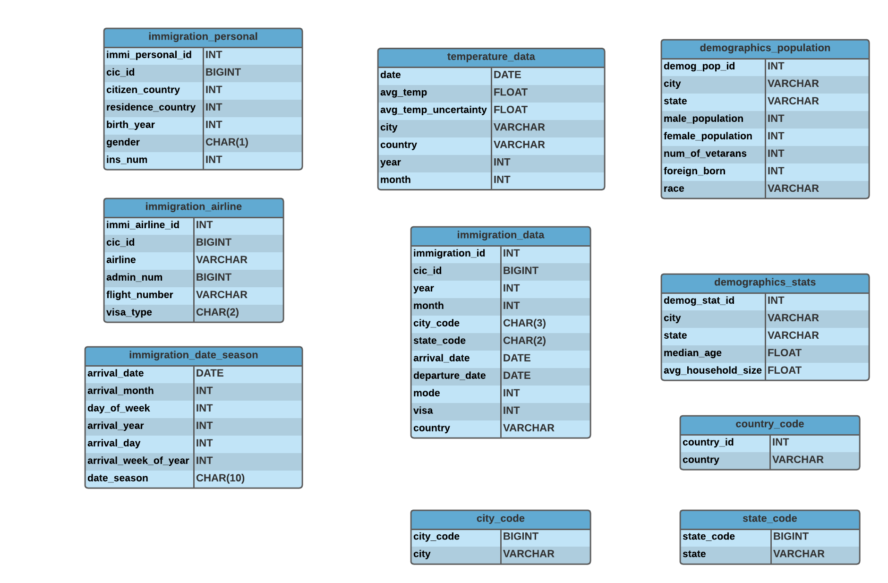
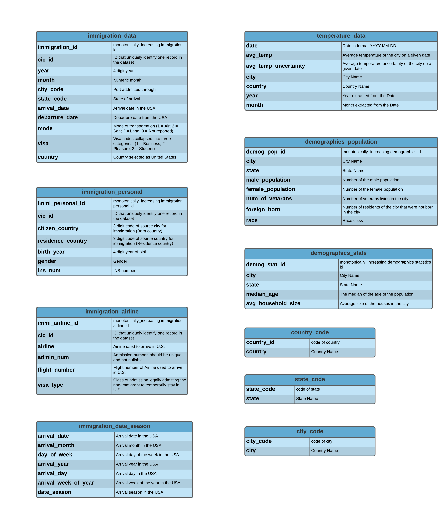

# Data Engineering Capstone Project

#### Project Summary
This project builds a data warehouse by integrating data from different data sources like immigration data , temperature data and demographic data for data analysis purpose.

Using the relation between the fact table "immigration_data" and other dimension tables, multiple data analysis can be done.
From the "immigration_date_season" we can identify,the season or month in which most people prefer to immigrate.
In "immigration_airline" we can identify the most widely used airline and visa_type used during immigration.
In "immigration_personal" we can do analysis by identifying the country from which most people migrate,from which age group and gender.
Using "temperature_data" we can analyse whether the average temperature of cities have impact on immigration.
In "demographics_population" different anaylsis can be done like identifying the different races of people residing in multiple cities and
"demographics_stats" can be used to do analysis to identify Average Household Size in different cities.
The tables "city_code", "state_code" and "country_code" helps us to give names of Cities, state and country from their corresponding codes respectively.
 
The project follows the follow steps:
* Step 1: Scope the Project and Gather Data
* Step 2: Explore and Assess the Data
* Step 3: Define the Data Model
* Step 4: Run ETL to Model the Data
* Step 5: Complete Project Write Up

---

## Step 1: Scope the Project and Gather Data

### Scope
This project will integrate I94 Immigration Dataset, U.S. City Demographic Dataset and World Temperature Dataset to build a data warehouse with the help of fact and dimension tables. The descriptions contained in the I94_SAS_Labels_Descriptions.SAS file is taken into account as well.

* Datasets used in the project:
    * I94 Immigration Dataset
    * U.S. City Demographic Dataset
    * World Temperature Dataset

* Tools used in the project:
    * AWS S3 for data storage on cloud.
    * Pandas for data analysis on small datasets and PySpark for data processing on large datasets.

### Describe and Gather Data 

#### Data Sets :

* [I94 Immigration Data](https://www.trade.gov/national-travel-and-tourism-office) : 
    This data comes from the US National Tourism and Trade Office. Dataset contains the traveler's immigration category, port of entry, data of entry into the United States, status expiration date and had a unique 11-digit identifying number assigned to it. Its purpose was to record the traveler's lawful admission to the United States. This is the main dataset and there is a file for each month of the year of 2016 available in the directory "../../data/18-83510-I94-Data-2016/" in the SAS binary database storage format sas7bdat.
    
* [World Temperature Data](https://www.kaggle.com/berkeleyearth/climate-change-earth-surface-temperature-data) :
    This dataset is from Kaggle and contains the monthly average temperature data of different countries from the world. In the original dataset from Kaggle, several files are available but in this capstone project we will be using only the "GlobalLandTemperaturesByCity.csv".

* [U.S. City Demographic Data](https://public.opendatasoft.com/explore/dataset/us-cities-demographics/export/) :
    This dataset contains information about the demographics of all US cities and census-designated places with a population greater or equal to 65,000.This data comes from OpenSoft and we will be using "us-cities-demographics.csv".
---
    
## Step 2: Explore and Assess the Data
### Explore the Data 

Used PySpark on the datasets to test ETL data pipeline logic and Split datasets to dimensional tables and changed the column names for better clarity.

---

## Step 3: Define the Data Model
### 3.1 Conceptual Data Model

We will model these data sets with star schema data modeling.

### 3.2 Mapping Out Data Pipelines

To accomplish all the tasks related to the preprocessing of the datasets, the steps can be found in [etl.py](https://github.com/rsuwasiya17/Data-Engineering-Capstone-Project/blob/main/etl.py) to load, select, clean, transform and store the resulting datasets in a very convenient way. The open-source framework Apache Spark was used as the main tool. Spark provides an interface for programming entire clusters with implicit data parallelism and fault tolerance.

All the logic of preprocessing is concentrated here in order to only represent the general steps of the ETL. We have also tested all the steps of [etl.py](https://github.com/rsuwasiya17/Data-Engineering-Capstone-Project/blob/main/etl.py) in [etl_capstone_project.ipynb](https://github.com/rsuwasiya17/Data-Engineering-Capstone-Project/blob/main/etl_capstone_project.ipynb) , but here the source and destination data is stored locally and rest of the logic and functionality are same. Data Quality of tables are also tested by verifying, empty tables are not present.

---
## Step 4: Run Pipelines to Model the Data 
### 4.1 Create the data model

The data pipeline is built inside the [etl.py](https://github.com/rsuwasiya17/Data-Engineering-Capstone-Project/blob/main/etl.py) file included with this Capstone Project.
We have also created one data pipeline locally for testing purpose using [etl_capstone_project.ipynb](https://github.com/rsuwasiya17/Data-Engineering-Capstone-Project/blob/main/etl_capstone_project.ipynb).

### 4.2 Data Quality Checks
Explain the data quality checks you'll perform to ensure the pipeline ran as expected. These could include:
 * Integrity constraints on the relational database (e.g., unique key, data type, etc.)
 * Unit tests for the scripts to ensure they are doing the right thing
 * Source/Count checks to ensure completeness
 
#### Run Quality Checks
We have tested and performed Data quality checks in **"etl_capstone_project.ipynb"**, following steps are performed for Data quality check.

#### 4.3 Data dictionary 
Create a data dictionary for your data model. For each field, provide a brief description of what the data is and where it came from. You can include the data dictionary in the notebook or in a separate file.

---

#### Step 5: Complete Project Write Up
* Clearly state the rationale for the choice of tools and technologies for the project.

The whole solution implemented here is mounted on top of AWS, since it provides a low-cost, scalable, and highly reliable infrastructure platform in the cloud. Every service we use (AWS S3, Apache Spark) has reasonable cost and is ‘pay as you go’ pricing. So we can start small and scale as our solution grows. No up-front costs involved.

In particular, why we use the following services:

* __S3:__ Provides a relatively cheap, easy-to-use with scalability, high availability, security, and performance. This seems to be perfect to a staging area like our solution here.

* __Spark:__ This is simply the best framework for big data processing, with built-in modules for streaming, SQL, machine learning and graph processing. Spark provides an interface for programming entire clusters with implicit data parallelism and fault tolerance.

Propose how often the data should be updated and why.
* Dimension tables only have to be updated when a new category is created by I94. However, the time dimension table (immigration_date) can be updated every month.
* Tables created from immigration and temperature data set should be updated monthly since the raw data set is built up monthly.
* The US Cities Demographics data is updated every ten years according to https://www.usa.gov/statistics , hence data set could be updated annually since demographics data collection takes time and high frequent demography might take high cost but generate wrong conclusion.

Write a description of how you would approach the problem differently under the following scenarios:
* **The data was increased by 100x:**
 
Deploy the Spark solution on a cluster using AWS (EMR cluster) and use S3 for data and parquet file storage. AWS will easily scale when data increases by 100x.
* **The data populates a dashboard that must be updated on a daily basis by 7am every day:**
 
Apache Airflow could be used for building up a ETL data pipeline to regularly update the date and populate a report. Apache Airflow also integrate with Python and AWS very well. More applications can be combined together to deliever more powerful task automation.

* **The database needed to be accessed by 100+ people:**

The saved parquet files can be bulk copied over to AWS Redshift cluster where it can scale big data requirements and has 'massively parallel' and 'limitless concurrency' for thousands of concurrent queries executed by users.
